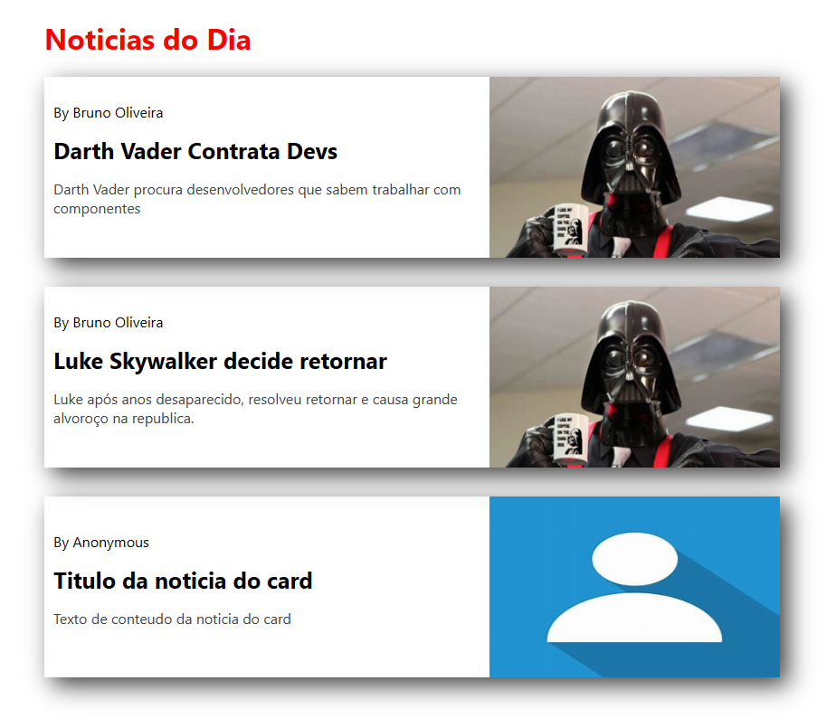

## Web Component
Neste projeto, criamos components reutilizáveis com javaScript, simulando a forma como um framework como React trabalha e tornando a aplicação dinâmica e deixando seu código isolado e fácil de manter.



Exemplo no documento HTML:
```
<!DOCTYPE html>
<html lang="pt-BR">
<head>
    <meta charset="UTF-8">
    <meta http-equiv="X-UA-Compatible" content="IE=edge">
    <meta name="viewport" content="width=device-width, initial-scale=1.0">
    <title>Web Component</title>
    <!-- CSS -->
    <link rel="stylesheet" href="./styles/card.css">
    <!-- Importando components -->
    <script src="./src/components/CardNews.js" defer></script>
    <script src="./src/components/TituloDinamico.js" defer></script>
</head>
<body>
    <main class="container">

        <titulo-dinamico titulo="Noticias do Dia"></titulo-dinamico>

        <card-news
            autor="Bruno Oliveira"
            title="Darth Vader Contrata Devs"
            link-url="#"
            content="Darth Vader procura desenvolvedores que sabem trabalhar com componentes"
            photo="./images/asset-vader.png"
            alt-photo="imagem do darth vader"
        ></card-news>

        <card-news
            autor="Bruno Oliveira"
            title="Luke Skywalker decide retornar"
            link-url="#"
            content="Luke após anos desaparecido, resolveu retornar e causa grande alvoroço na republica."
            photo="./images/asset-vader.png"
            alt-photo="imagem do darth vader"
        ></card-news>

        <card-news></card-news>
        
    </main>
</body>
</html>
```