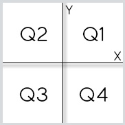

## 🏆 Desafio 02 - Coordenadas de um Ponto
Leia 2 valores com uma casa decimal (x e y), que devem representar as coordenadas de um ponto em um plano. A seguir, determine qual o quadrante ao qual pertence o ponto, ou se está sobre um dos eixos cartesianos ou na origem (x = y = 0).



Se o ponto estiver na origem, escreva a mensagem “Origem”.

Se o ponto estiver sobre um dos eixos escreva “Eixo X” ou “Eixo Y”, conforme for a situação.

<br>

## Entrada
A entrada contem as coordenadas de um ponto.

<br>

## Saída
A saída deve apresentar o quadrante em que o ponto se encontra.

<br>

<table>
    <thead>
        <tr>
            <th>Exemplos de Entrada</th>
            <th>Exemplos de Saída</th>
        </tr>
    </thead>
    <tbody>
        <tr>
            <td>4.5 -2.2</td>
            <td>Q4</td>
        </tr>
        <tr>
            <td>0.1 0.1</td>
            <td>Q1</td>
        </tr>
        <tr>
            <td>0.0 0.0</td>
            <td>Origem</td>
        </tr>
    </tbody>
</table>

<br>

Para executar os testes no terminal, verifique que está dentro da pasta do desafio e execute o comando abaixo no terminal:
```
node desafio-02.js
```

> O arquivo auxiliar.js é apenas um arquivo para inserir as entradas e utilizarmos as funções gets e print, simulando o mesmo ambiente da DIO.