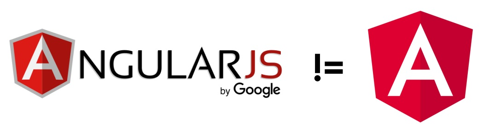

## 📝 Curso 01: Introdução ao Ecossistema Angular
### ANGULARJS VS ANGULAR

AngularJS é a versão mais antiga do Angular, desenvolvida pelo Google e é um dos frameworks front-end mais antigos para construção de SPAs. No entanto, o Google recentemente encerrou o suporte ao AngularJS, tornando o Angular a escolha óbvia entre os dois. AngularJS é conhecido como Angular 1 e tem algumas diferenças em relação ao Angular 2+. O Angular 2 foi lançado em 2016 como um projeto completamente novo, sem compatibilidade com o AngularJS. A partir do Angular 2, o TypeScript se tornou a linguagem oficial para o desenvolvimento de aplicações Angular, em vez do JavaScript, utilizado no AngularJS.

AngularJs
- Initial release date: October 20, 2010
- Developer(s): Google
- Written in: JavaScript

Angular
- Developer(s): Google
- Initial release: 2.0 | 14 September, 2016
- License: MIT
- Stable release: 14.1.0 | 20 Jully, 2022
- Written in: TypeScript

 

### Principais diferenças
Uma das principais diferenças entre Angular e AngularJS é que AngularJS é baseado em JavaScript, enquanto Angular é baseado em TypeScript. Isso significa que você precisa usar TypeScript no Angular para criar aplicações. TypeScript é um superconjunto tipado de JavaScript e possui várias vantagens, como código auto-documentado e verificações de tipo em tempo de desenvolvimento. Além disso, o Angular é baseado em componentes, enquanto o AngularJS usa diretivas. A arquitetura do Angular também é diferente da do AngularJS, com o primeiro usando uma arquitetura baseada em componentes e o segundo usando uma arquitetura MVC.