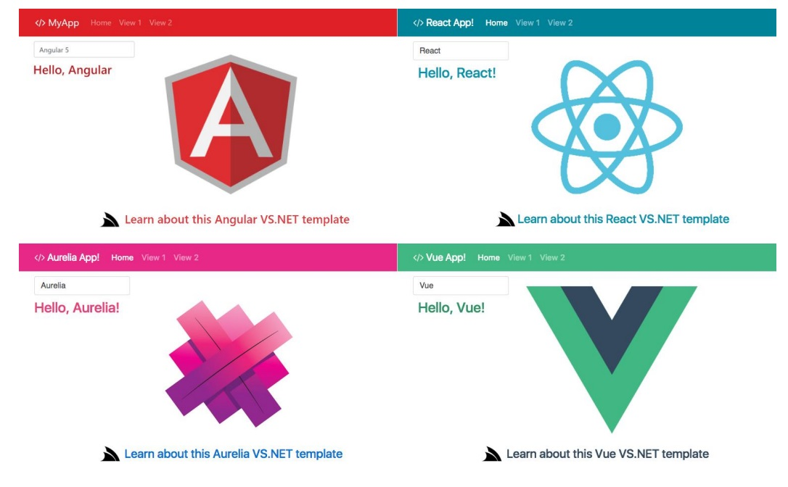

## 📝 Curso 01: Introdução ao Ecossistema Angular
### Angular no mercado de frameworks

Angular, React e Vue são três dos frameworks front-end mais populares para construção de aplicações web. Aurelia é um framework progressivo mais recente que também está ganhando popularidade. Cada um desses frameworks tem suas próprias características e vantagens. Angular é um framework completo para desenvolvimento front-end, enquanto React é uma biblioteca de interface do usuário e Vue é um framework progressivo. Angular é conhecido por sua arquitetura baseada em componentes, uso do TypeScript e ampla gama de recursos, incluindo roteamento, gerenciamento de formulários e comunicação cliente-servidor. React é conhecido por sua abordagem baseada em componentes e pelo uso do Virtual DOM para melhorar o desempenho. Vue é conhecido por sua facilidade de uso e flexibilidade, permitindo aos desenvolvedores escolher quais recursos usar. Aurelia é conhecido por sua abordagem convencional sobre configuração e pelo uso de padrões web modernos.

Angular oferece várias vantagens em relação a outros frameworks front-end. Uma das principais vantagens é o uso do TypeScript, que ajuda os desenvolvedores a manter o código limpo e compreensível. Além disso, Angular possui uma arquitetura baseada em componentes e inclui recursos como injeção de dependência, vinculação de dados bidirecional e um sistema de módulos integrado. Angular também oferece fácil acesso às informações, maior segurança de dados, facilidade de manutenção e testes simples .