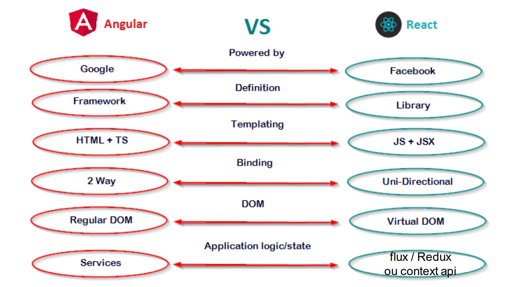

## 📝 Curso 01: Introdução ao Ecossistema Angular
### As Estratégias Angular comparada a outras ferramentas

Angular é um framework completo para desenvolvimento front-end e oferece várias estratégias para melhorar o desempenho de aplicações web. Algumas dessas estratégias incluem:

- Carregamento preguiçoso: Angular permite que você divida sua aplicação em módulos menores e os carregue de forma preguiçosa, reduzindo o tempo de carregamento inicial e melhorando o desempenho.

- Detecção de mudanças: Angular usa detecção de mudanças para detectar alterações nos dados e atualizar a visualização. Você pode otimizar a detecção de mudanças para reduzir atualizações desnecessárias da visualização e melhorar o desempenho.

- Otimização de requisições HTTP: Angular permite que você otimize suas requisições HTTP, reduzindo o número de requisições e o tamanho dos dados enviados. Isso pode melhorar o tempo de carregamento e o desempenho da aplicação.

- Estratégia de cache: Angular permite que você implemente uma estratégia de cache eficiente para reduzir requisições HTTP desnecessárias e melhorar o tempo de carregamento.

Essas são apenas algumas das estratégias que você pode usar para melhorar o desempenho de suas aplicações Angular. É importante notar que outras ferramentas, como React, Vue e Aurelia, também oferecem suas próprias estratégias para melhorar o desempenho. A escolha da ferramenta certa depende das necessidades específicas do seu projeto.